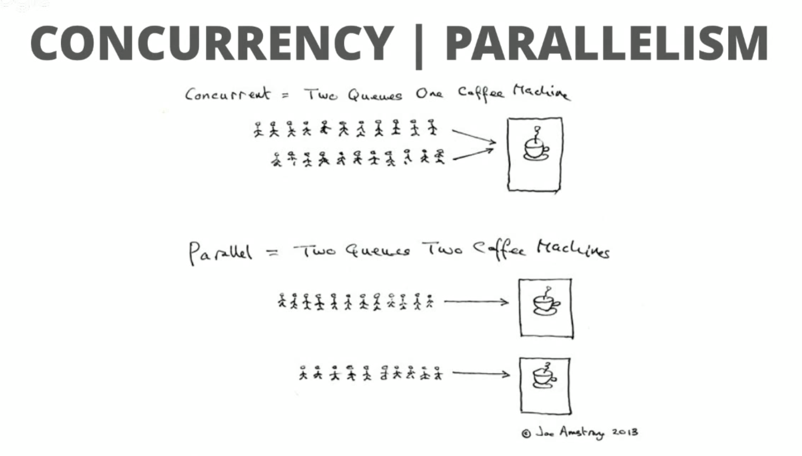

# concurrency and parallelism

concurrency是指兩個或兩個以上的動作能同時存在並在同一個時間線上交互運作

parallelism是指兩個或兩個以上的動作能同時存在並在同一個時間線上同時運作

引用Erlang 之父 Joe Armstrong解釋concurrency and parallelism的圖片做說明

當兩隊人同時使用一台咖啡機時則需要交替使用就是concurrency

當兩隊人能同時使用兩台咖啡機時就是parallelism

## 解釋
把咖啡機想成是一顆CPU，一個隊伍就是一個goroutine，不管CPU有多少個都可以執行兩個或兩個以上的goroutine，差異只是在能否同時執行

concurrency只是指在一個CPU上執行多個goroutine，透過CPU內核調度分配每一個goroutine可以執行的時間

parallelism是指可以利用多個CPU來執行多個goroutine

> concurrency and parallelism都可以執行多個goroutine，只是一個是在單一CPU內輪流執行，另一個是可以goroutine可以同時被多個CPU執行

[參考](https://blog.golang.org/concurrency-is-not-parallelism)

## 實驗

使用單核並開兩個goroutine，由於邏輯不複雜且又是交替執行所以第一個goroutine會比第二goroutine執行的還要快

    func main() {
        runtime.GOMAXPROCS(1)

        var wg sync.WaitGroup

        wg.Add(2)

        go func() {
            defer wg.Done()

            for c := 'a'; c < 'a'+26; c++ {
                fmt.Printf("%c ", c)
            }
        }()

        go func() {
            defer wg.Done()

            for n := 1; n < 27; n++ {
                fmt.Printf("%d ", n)
            }
        }()

        wg.Wait()
    }
    
    // 1 2 3 4 5 6 7 8 9 10 11 12 13 14 15 16 17 18 19 20 21 22 23 24 25 26 a b c d e f g h i j k l m n o p q r s t u v w x y z 

使用雙核並開兩個goroutine，可以發現第一跟二goroutine其實是同時一起跑

    func main() {
        runtime.GOMAXPROCS(2)

        var wg sync.WaitGroup

        wg.Add(2)

        go func() {
            defer wg.Done()

            for c := 'a'; c < 'a'+26; c++ {
                fmt.Printf("%c ", c)
            }
        }()

        go func() {
            defer wg.Done()

            for n := 1; n < 27; n++ {
                fmt.Printf("%d ", n)
            }
        }()

        wg.Wait()
    }

    // a b c d e f g h i j k 1 2 3 4 5 6 7 8 9 10 11 12 13 14 15 16 17 18 19 20 21 22 23 24 25 26 l m n o p q r s t u v w x y z